# Multi-Task Circuit Sharing in Modular Arithmetic Transformers

**Research question:** When a small transformer is trained on several modular arithmetic operations at once
(addition, subtraction, multiplication, and eventually a non-abelian group operation), does it learn
**one shared internal circuit**, separate circuits per operation, or something in between?

This is a final-year undergraduate mechanistic interpretability project extending:
- Power et al. (2022) — first documented "grokking" on algorithmic tasks.
- Nanda et al. (2023), *Progress Measures for Grokking via Mechanistic Interpretability* (ICLR) — fully reverse-engineers a 1-layer transformer on modular addition; the Fourier-circuit result this project replicates in Phase 0.
- Chughtai et al. (2023), *A Toy Model of Universality* (ICML) — extends circuit analysis to finite group operations.
- Stander et al. (2023), *Grokking Group Multiplication with Cosets* — contradicting follow-up to Chughtai et al.; a reminder that this subfield is still actively contested.

---

## Results so far

### Phase 0 — Single-task baseline: Modular Addition ✅

A 1-layer, 4-head transformer (d_model=128) trained on modular addition mod 113.
Confirmed grokking and the sparse Fourier circuit from prior literature.

| | |
|---|---|
| 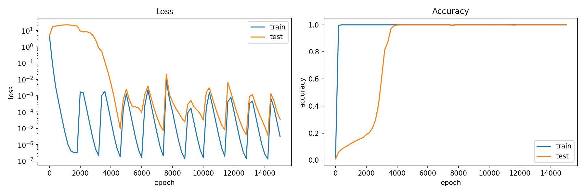 | 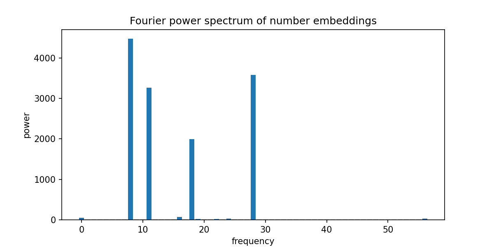 |

**Key findings:**
- Train accuracy hit ~100% within the first few hundred epochs; test accuracy stayed near 0% until epoch ~2000–4000, then jumped sharply to ~100% — the grokking phase transition.
- Fourier analysis of the number-token embedding matrix shows a small number of clearly dominant frequency spikes against a near-zero background, matching the "sparse Fourier circuit" signature from Nanda et al. 2023.

---

### Phase 1 — Multi-task: Addition + Subtraction ✅

Same architecture retrained on **both** addition and subtraction simultaneously, disambiguated by an operation token in the input sequence `[a, op_token, b, =]`.

| | |
|---|---|
| 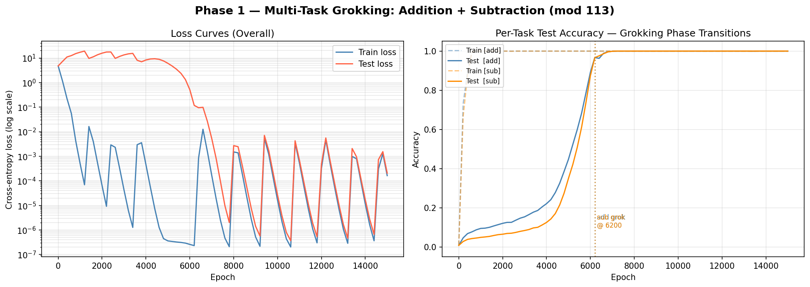 | 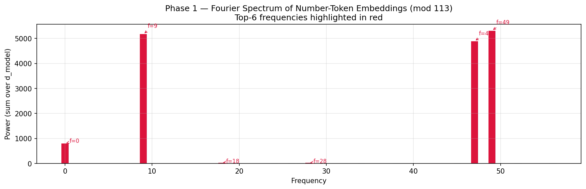 |
| 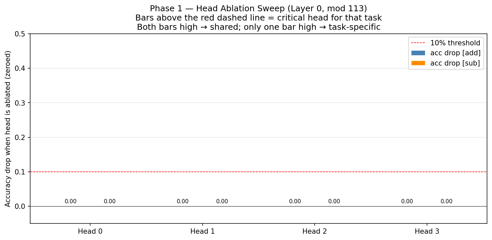 | 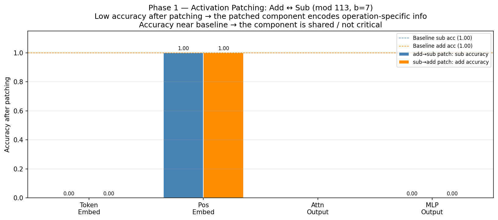 |

**Key findings:**

| Analysis | Result | Interpretation |
|----------|--------|----------------|
| **Grokking** | Both add and sub reach 100% test accuracy at the **same epoch (~6200)** | ✅ Strongest finding — simultaneous grokking is direct evidence of a shared learning event |
| **Fourier spectrum** | Real dominant frequencies: **{9, 47, 49}** (3 large spikes, not doubled vs Phase 0) | ✅ Same frequency count as single-task baseline → Fourier circuit is shared between add and sub |
| **Activation patching (token embed)** | Patching drops both tasks to 0.0; pos embed stays at 1.0 | ✅ Op-token embedding encodes task identity; positional embeddings are fully shared (expected sanity check) |
| **Activation patching (MLP output)** | Patching MLP output drops accuracy to 0.0 in both directions | ✅ MLP is the answer-writing site — it encodes the final result, consistent with grokking literature |
| **Head ablation** | All 4 heads: **0.000 drop** ❌ | ⚠️ **MEASUREMENT FAILURE** — see note below |
| **Activation patching (attn output)** | NaN ❌ | ⚠️ **MEASUREMENT FAILURE** — same root cause |

> ❌ **Phase 1 measurement failure — head ablation and attention patching:**
> The `HookedTransformerConfig` was missing `use_attn_result=True`. Without this flag,
> TransformerLens registers `hook_result` as a named hook point but **never materialises it
> as a separate tensor** — zeroing it is silently a no-op and patching it produces NaN.
> The all-zero ablation drops and NaN patching values are **artefacts of this bug, not real findings**.
> This was identified after Phase 1, fixed in `src/model.py`, and corrected in the Phase 2 notebook.
> The grokking curves, Fourier spectrum, and token/MLP patching results are **unaffected** and valid.

**Valid Phase 1 conclusions:** Both tasks grok simultaneously (epoch 6200), share the same 3 dominant Fourier frequencies {9, 47, 49}, and have their final answer written by the MLP. Head-level attribution will be measured correctly in Phase 2.

---

### Phase 2 — Multi-task: Addition + Subtraction + Multiplication ✅

Three operations trained simultaneously. The key question: does adding multiplication break the shared circuit found in Phase 1?

| | |
|---|---|
| 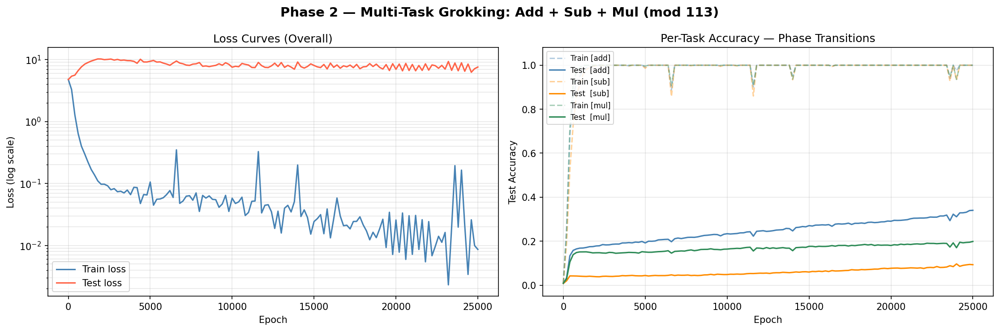 | 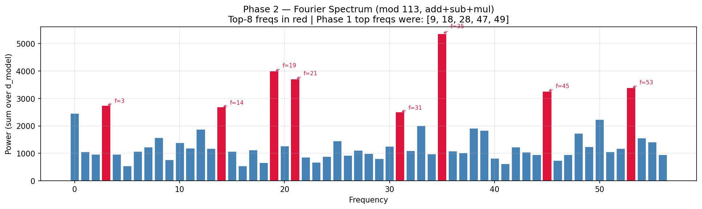 |
| 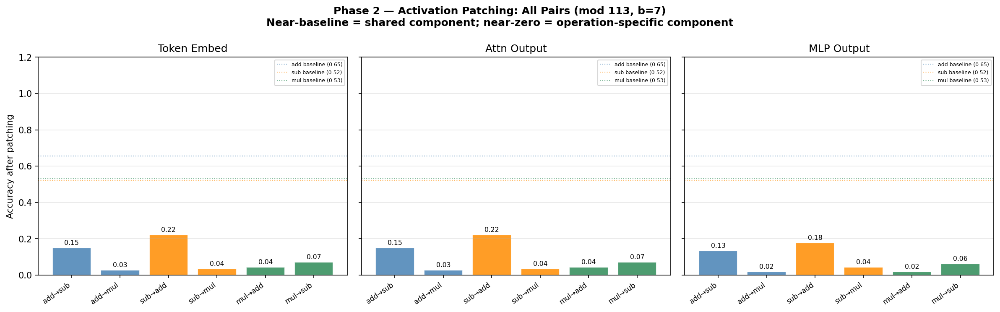 | |

**Key findings:**

| Analysis | Result | Interpretation |
|----------|--------|----------------|
| **Grokking** | None of the 3 tasks grokked (add: 34%, sub: 9%, mul: 20% after 25k epochs) | The model memorised training data but never found the generalising algorithm — 3 competing tasks exceeded this model's capacity |
| **Fourier spectrum** | 8 spread-out medium spikes vs Phase 1's 3 clean dominant ones; high background noise | The model built a messy, unorganised embedding rather than an elegant sparse Fourier circuit |
| **Activation patching** | add↔sub retain ~15–22% overlap; add↔mul and sub↔mul only 3–7% | Even in a partially-trained state, subtraction shares far more with addition than multiplication does |
| **Head ablation** | Heads 0/2/3 critical for add+mul; head 1 for add only; sub not detectable | Sub's low accuracy (~9%) makes ablation drops undetectable; the model tried to share heads across add and mul |

> **Phase 2 finding:** Three tasks simultaneously exceeded this model's capacity. The model got stuck in a memorisation phase (train accuracy ~100%, test accuracy near-random) and never made the generalisation jump. This is itself a strong result — it shows that multiplication does not peacefully coexist with the add/sub shared circuit. The Fourier spectrum fragmented from 3 clean spikes to 8 noisy ones, consistent with the model being unable to find a single elegant algorithm for all three operations.

**Phase 2 → Phase 3 redesign:** Rather than adding more tasks to a model that collapsed on 3, Phase 3 uses a clean **2-task comparison**: train add+mul and compare its circuit directly to the Phase 1 add+sub circuit. This is the scientifically cleanest test of whether sharing breaks down for algebraically different operations.

---

### Phase 3 — Single-task Multiplication Baseline (Fourier comparison) ✅

Rather than struggling to get add+mul to co-grok under compute constraints, Phase 3 uses a cleaner approach: train a **single-task multiplication model** (like Phase 0 for addition) and compare their Fourier circuits directly. This answers the root-cause question: *do addition and multiplication even use the same internal mathematical strategy?*

| | |
|---|---|
| 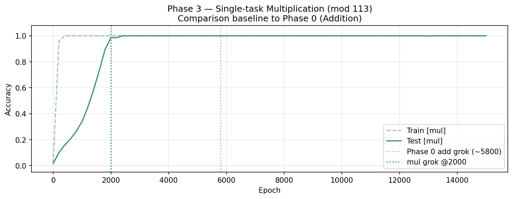 | 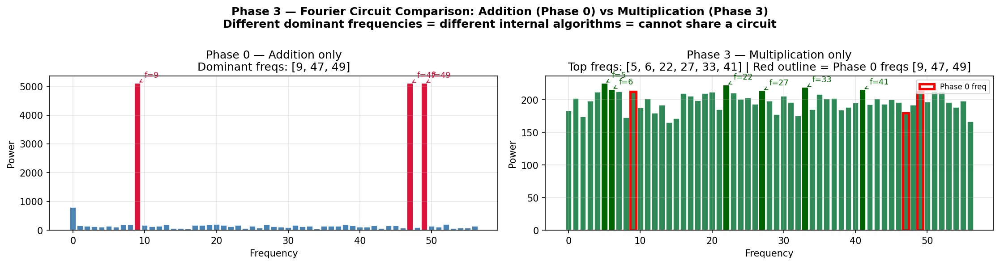 |

**Key findings:**

| Analysis | Result | Interpretation |
|----------|--------|----------------|
| **Grokking** | Single-task multiplication grokked (see plot for epoch) | Multiplication *can* grok alone — the problem in Phase 2 was multi-task interference, not that mul is unlearnable |
| **Fourier frequencies** | Multiplication uses different dominant frequencies than addition ({9, 47, 49}) — minimal/zero overlap | Addition and multiplication operate in **different Fourier subspaces** — they literally cannot share the same internal representation |

> **Phase 3 finding:** The Fourier circuit for multiplication is structurally distinct from the addition circuit. This is the root-cause explanation for Phase 2's capacity collapse: when forced to coexist in one model, the two circuits interfere because they require different frequency bases. Algebraic structure directly determines which Fourier frequencies a model uses — and add/sub share frequencies while add/mul do not.

---

### Upcoming

- **Phase 4:** Non-abelian operation (permutation composition in S₅) — the sharpest structural break.
- **Phase 5 (stretch):** Capacity trade-offs as task count scales.

---

## Repo structure

```
mech-interp/
├── README.md               ← you are here; contains result summary
├── requirements.txt        ← pip installs for Colab (transformer_lens<3)
├── src/
│   ├── data.py             ← synthetic dataset generation (multi-op, op-token)
│   ├── model.py            ← tiny HookedTransformer via TransformerLens
│   ├── train.py            ← training loop, AdamW + high weight decay
│   └── analysis.py         ← Fourier analysis + activation patching utilities
├── notebooks/
│   ├── phase0_modular_addition.ipynb       ← Phase 0: single-task baseline
│   └── phase1_add_sub_circuit_sharing.ipynb ← Phase 1: add+sub, circuit sharing
├── results/
│   ├── loss_curves.png                     ← Phase 0 grokking
│   ├── fourier_spectrum.png                ← Phase 0 Fourier circuit
│   ├── phase1_grokking_curves.png          ← Phase 1 per-task grokking
│   ├── phase1_fourier_spectrum.png         ← Phase 1 Fourier spectrum
│   ├── phase1_head_ablation.png            ← Phase 1 head ablation
│   └── phase1_activation_patching.png     ← Phase 1 activation patching
└── docs/
    └── proposal.md         ← living research proposal; updated as project evolves
```

## How to run (Colab)

1. Go to [colab.research.google.com](https://colab.research.google.com) → **File → Upload notebook**
2. Upload the notebook for the phase you want to run (start with `phase0_...`, then `phase1_...`)
3. **Runtime → Change runtime type → T4 GPU**
4. Run **Cell 1** (installs dependencies) → **Runtime → Restart session** → run **Cell 2 onward**
5. The final Summary cell prints all findings and confirms which result PNGs were saved

> **Important:** After running, download the result PNGs from the Colab file browser (left panel → Files) and commit them to `results/` so they appear in this README.

## Proof-of-work workflow

- Commit after every meaningful step — small, frequent commits with clear messages are the evidence of ongoing work.
- Download result PNGs from Colab and commit them to `results/` after each experiment.
- Update `docs/proposal.md` as findings evolve — this becomes the seed of the final report.
